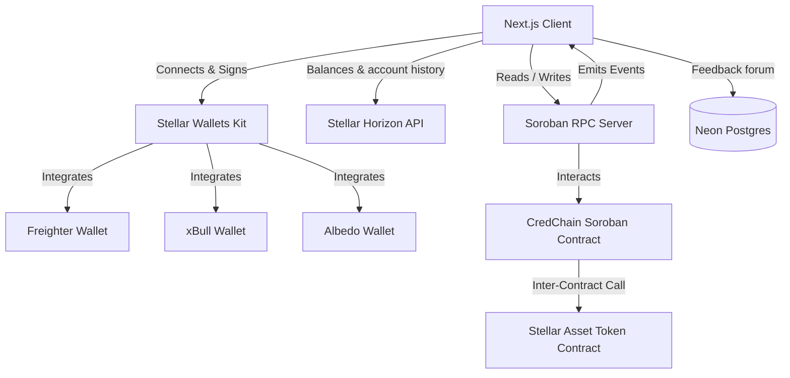

# CredChain — Blockchain-Verified Credentials

CredChain is a decentralized credential platform built on Stellar Soroban. Registered
institutions issue tamper-proof credentials on-chain, anyone can verify one from a
public page or a QR code without a wallet, and revocation is transparent and immediate.

> **Trust model:** institution registration is permissionless. The contract guarantees
> that a credential was issued by a specific address and has not been altered or
> revoked; it does not certify that the address belongs to the organization it claims
> to be. Verifying that mapping is out of scope for the contract.

## Live demo & deployment

| | |
|---|---|
| **Live app** | [credchain-stellar.vercel.app](https://credchain-stellar.vercel.app) |
| **Try it in 3 minutes** | [/start](https://credchain-stellar.vercel.app/start) — guided walkthrough |
| **Public registry** | [/credentials](https://credchain-stellar.vercel.app/credentials) — every credential ever issued |
| **Contract** | `CBYG2PMXPMCCMINZ5ZNJSFFLRWBBIEHOKHXQEC5BEXKKZRBL7Y2S4YUK` |
| **Contract admin** | `GDLQBRN3FUDPD2U24Z7GQF7VRM5DW3CV2Y4WVPQLOV7WLX536F6ZPKIA` |
| **Network** | Stellar Testnet |

The admin is bound at deploy time by `__constructor(admin)` and can only be changed by
the current admin via `transfer_admin`. `configure_fees` rejects every other caller
with `NotAuthorized`.

## System architecture



---

## Features

### Issuing

* **Institution registration** — register an issuing organization on-chain. Open and
  self-service; the contract records the registering address, it does not vouch for it.
* **Credential issuance** — issue a credential to any Stellar address, carrying the
  holder's name and the credential title.
* **Revocation** — revoke a credential you issued, with the change visible on-chain
  immediately.

### Verifying

* **Public verification page** — `/verify/<id>` renders a credential as a certificate,
  with a valid/revoked banner. **No wallet required**; everything is read from the
  ledger.
* **QR codes** — every credential page carries a QR pointing back at itself, so a phone
  camera is a sufficient verification tool.
* **Print / Save as PDF** — a print stylesheet strips the site chrome so the credential
  prints cleanly.
* **Credential registry** — `/credentials` lists every credential ever issued, with
  totals, live status, and a filter across ids, holders, titles, and issuers.

### Onboarding

* **Guided walkthrough** — `/start` takes a newcomer from no wallet to a verified
  credential in five steps that unlock from live chain state.
* **In-app testnet funding** — a Friendbot button covers transaction fees without
  leaving the page.
* **Network mismatch detection** — the app compares the wallet's network against its
  own and says so, rather than failing at signing time.
* **Wallet session persistence** — stay signed in for this browser session, 1, 7, or 30
  days. Only the public address is stored; signing always goes through the wallet.

### Platform

* **Real-time event sync** — RPC event polling drives toasts, cache invalidation, and a
  live sync badge.
* **Full activity history** — the feed backfills the whole RPC retention window on load
  and pulls account history from Horizon.
* **Community feedback forum** — wallet-signed attribution, verified server-side.
* **Multi-wallet** — Freighter, xBull, and Albedo via Stellar Wallets Kit.
* **Dark mode**, mobile-responsive throughout.

---

## How credential metadata works

The contract stores only `id`, `issuer`, `recipient`, `metadata_uri`, `issued_at`, and
`revoked`. Holder names and credential titles live **inside `metadata_uri`**, encoded as
a self-contained data URI:

```
data:application/json;base64,eyJob2xkZXIiOiJBZGEgTG92ZWxhY2UiLC...
```

which decodes to:

```json
{ "holder": "Ada Lovelace", "title": "BSc Computer Science" }
```

Verification therefore needs **no server and no external fetch** — the entire credential
is on the ledger. The alternative, an HTTPS or IPFS pointer, would make every verifier
trust a host that could change or lose the content.

The issuer's name is deliberately *not* in the payload. It is read from
`get_institution(issuer)` on-chain, so whoever wrote the metadata cannot forge it.

Credentials whose `metadata_uri` is a plain string (issued before this encoding, or by
another client) still verify correctly — the page falls back to showing the raw URI.
The codec lives in [`client/src/lib/credential.ts`](client/src/lib/credential.ts).

---

## Tech stack

| Layer | Choice |
|---|---|
| Smart contract | Rust + Soroban SDK 25, `#![no_std]` |
| Frontend | Next.js 16 (App Router) + React 19 + TypeScript |
| Styling | Tailwind CSS 4 + shadcn/ui |
| State | Zustand + TanStack Query |
| Chain access | `@stellar/stellar-sdk` (Soroban RPC + Horizon) |
| Wallets | `@creit.tech/stellar-wallets-kit` |
| QR | `qrcode` |
| Forum storage | Neon Postgres over the HTTP driver |
| Tests | `cargo test` (21) + Vitest (92) |

---

## Folder structure

```
credchain/
├── contract/                          # Soroban smart contract
│   ├── src/
│   │   ├── lib.rs                     # Entire contract implementation
│   │   └── test.rs                    # Contract tests
│   ├── test_snapshots/                # Golden files backing the tests
│   └── Makefile
├── client/                            # Next.js frontend
│   ├── src/
│   │   ├── app/
│   │   │   ├── page.tsx               # Landing page
│   │   │   ├── start/                 # Guided onboarding walkthrough
│   │   │   ├── app/                   # Issue / register / revoke
│   │   │   ├── verify/                # Public lookup + /verify/[id] certificate page
│   │   │   ├── credentials/           # Public registry of every credential
│   │   │   ├── dashboard/             # Wallet, Send XLM, institution overview
│   │   │   ├── activity/              # Event feed + account history
│   │   │   ├── analytics/             # Telemetry and feedback forum
│   │   │   ├── docs/                  # In-app documentation portal
│   │   │   └── api/feedback/          # Only server-side surface
│   │   ├── components/
│   │   │   ├── ui/                    # UI primitives
│   │   │   ├── Navbar.tsx
│   │   │   ├── WalletModal.tsx
│   │   │   ├── NetworkBanner.tsx      # Wrong-network warning
│   │   │   ├── RememberWalletPrompt.tsx
│   │   │   ├── ActivityFeed.tsx
│   │   │   └── TransactionTracker.tsx
│   │   ├── hooks/
│   │   │   ├── contract.ts            # TanStack Query contract read/write hooks
│   │   │   └── useContractEventsListener.ts
│   │   ├── stores/                    # Zustand: wallet, transactions, activity
│   │   ├── lib/
│   │   │   ├── credential.ts          # On-chain metadata codec
│   │   │   ├── wallet-session.ts      # Session persistence + expiry
│   │   │   ├── activity-history.ts    # Event backfill + Horizon history
│   │   │   ├── error-decoder.ts       # ContractError -> human message
│   │   │   ├── contracts.ts           # Network config
│   │   │   └── scval.ts               # ScVal converters
│   │   └── types/
│   ├── scripts/deploy.sh
│   └── .env.example
└── README.md
```

---

## Setup & run

### Prerequisites

* [Rust](https://rustup.rs/) (stable)
* [Node.js](https://nodejs.org/) 18+
* [Stellar CLI](https://developers.stellar.org/docs/tools/cli) on PATH
* Freighter, xBull, or Albedo browser extension

### Environment variables

```bash
cd client
cp .env.example .env
```

```env
NEXT_PUBLIC_STELLAR_NETWORK=testnet
NEXT_PUBLIC_STELLAR_NETWORK_PASSPHRASE="Test SDF Network ; September 2015"
NEXT_PUBLIC_STELLAR_RPC_URL=https://soroban-testnet.stellar.org
NEXT_PUBLIC_CONTRACT_ADDRESS=CBYG2PMXPMCCMINZ5ZNJSFFLRWBBIEHOKHXQEC5BEXKKZRBL7Y2S4YUK

# Optional — enables the community feedback forum. See below.
DATABASE_URL=postgresql://...
```

### Local development

```bash
cd client
npm install
npm run dev
```

Open `http://localhost:3000`.

### Community feedback forum (optional)

The forum needs a Postgres database. **Neon** is the expected provider: its compute
scales to zero when idle and resumes automatically on the next request, so the forum
still works after long stretches of no traffic. Providers that *pause* a project after
inactivity will leave the forum dead until manually resumed.

1. Create a database at [neon.com](https://neon.com), or add Neon from the Vercel
   Marketplace — which populates `DATABASE_URL` automatically.
2. Put the connection string in `client/.env` as `DATABASE_URL`.
3. Create the schema once: `cd client && npm run init-db`

Leave `DATABASE_URL` unset to run without the forum. The API reports itself as
unconfigured and the UI says so explicitly — posts are never silently accepted and
discarded.

Feedback from a connected wallet is signed and verified server-side before being
attributed. Unsigned submissions publish anonymously; a claimed address without a valid
signature is ignored.

---

## Smart contract build & deployment

```bash
cd contract
stellar contract build

# The trailing `-- --admin` passes the constructor argument. Without it the deploy
# fails: the contract has no unauthenticated path to set an admin afterwards.
stellar contract deploy \
  --wasm target/wasm32v1-none/release/credchain.wasm \
  --source dev \
  --network testnet \
  -- \
  --admin <YOUR_G_ADDRESS>
```

Or use the script, which builds, deploys, binds the admin, and regenerates the
TypeScript bindings in one pass:

```bash
ADMIN_ADDRESS=<YOUR_G_ADDRESS> bash client/scripts/deploy.sh
```

**A deploy mints a new contract address with empty state — there is no upgrade path.**
The new address must then be propagated by hand to `client/.env`, the Vercel project
env, `.github/workflows/ci.yml`, and this README.

### Contract interface

| Function | Auth | Purpose |
|---|---|---|
| `__constructor(admin)` | — | Binds the admin at deploy time |
| `register_institution(addr, name)` | `addr` | Self-service issuer registration |
| `issue_certificate(issuer, recipient, metadata_uri)` | `issuer` | Returns the new certificate id |
| `revoke_certificate(caller, cert_id)` | `caller` = issuer | Marks a credential revoked |
| `configure_fees(admin, token, treasury, fee)` | `admin` | Optional registration fee |
| `transfer_admin(current, new)` | `current` | Hands over the admin seat |
| `get_certificate(cert_id)` | — | Read a credential |
| `get_institution(addr)` | — | Read an issuer and its count |
| `verify_certificate(cert_id)` | — | `true` unless missing or revoked |
| `is_institution(addr)` | — | Registration check |
| `get_all_institutions()` | — | Every registered issuer |

Error codes: `1=NotRegistered, 2=AlreadyRegistered, 3=NotAuthorized,
4=CertificateNotFound, 5=AlreadyRevoked, 6=InvalidInput`. Mirrored in
[`client/src/lib/error-decoder.ts`](client/src/lib/error-decoder.ts).

---

## Testing

```bash
cd contract && cargo test      # 21 contract tests
cd client && npm run test      # 92 frontend tests
```

Frontend tests cover the XDR helpers, Zustand stores, the contract error decoder, the
feedback signing payload, the credential metadata codec, and wallet session expiry.

---

## CI/CD pipeline

**CI** — `.github/workflows/ci.yml`, on every push and pull request to `main`:

1. Sets up the Rust toolchain (`rustfmt`, `clippy`).
2. Checks contract formatting (`cargo fmt --check`).
3. Runs static analysis (`cargo clippy -- -D warnings`).
4. Runs all 21 contract unit tests.
5. Builds the WASM target and asserts it stays under Soroban's 64 KB limit.
6. Installs frontend dependencies and audits them (`npm audit --audit-level=critical`).
7. Runs frontend linting.
8. Runs all frontend unit tests.
9. Performs a Next.js production build.

**CD** — `.github/workflows/cd.yml`:

* **Frontend** deploys to Vercel on every push to `main`.
* **Contract** deploys only via manual `workflow_dispatch`. A deploy mints a new address
  and starts from empty state, so it is deliberately not tied to commits.

Neither workflow swallows command failures.

---

## Working states & screenshots

### 1. Wallet connected
Connect Freighter, xBull, or Albedo. The address and status appear in the dashboard.


### 2. Balance displayed
The XLM balance is fetched directly from Horizon.


### 3. Testnet transaction
Transfers are signed with the connected wallet and broadcast to the network.


### 4. Transaction result
Pending, success, and failure states are surfaced with a link to the Stellar Explorer.


### 5. Mobile responsive
Verified on mobile, tablet, and desktop viewports.


### 6. CI/CD pipeline
GitHub Actions builds, lints, formats, and tests on every push and pull request.


### 7. Automated test output
All contract and frontend tests pass.


---

## Roadmap

1. **IPFS metadata pinning** — offer content-addressed storage as an alternative to the
   inline data URI for payloads too large to sit on-chain.
2. **Batch issuance** — issue to many recipients in a single transaction.
3. **CSV recipient import** — upload a recipient list and issue in bulk.
4. **Multi-signature revocation** — require more than one authorizer to revoke.
5. **Issuer verification** — an attestation layer mapping addresses to real
   organizations, closing the gap the trust model calls out above.

---

## Level 5 submission checklist

| Requirement | State |
|---|---|
| Public GitHub repository | ✅ [Kalpesh-ops/CredChain](https://github.com/Kalpesh-ops/CredChain) |
| 20+ meaningful commits | ✅ 55+ |
| Live deployed application | ✅ [credchain-stellar.vercel.app](https://credchain-stellar.vercel.app) |
| Product improvements from feedback | ✅ See *Feedback-driven improvements* below |
| Updated documentation | ✅ This README plus the in-app [docs portal](https://credchain-stellar.vercel.app/docs) |
| Pitch deck | ⬜ _Pending._ |
| Demo video | ⬜ _Pending._ |
| Proof of 50+ onboarded users | ⬜ _Pending._ |
| Analytics / transaction screenshots | ⬜ _Pending._ |
| User feedback iteration summary | ⬜ _Pending._ |

### User onboarding & feedback collection

Users are onboarded through the guided [`/start`](https://credchain-stellar.vercel.app/start)
walkthrough and asked to complete a feedback form capturing their name, email, wallet
address, and a product rating. Responses are exported to a spreadsheet linked here once
collection closes.

_Form link: pending. Exported responses: pending._

Every claimed user is independently checkable: the form records the certificate id each
person issued, and that id resolves on the public
[registry](https://credchain-stellar.vercel.app/credentials) and at `/verify/<id>`. The
on-chain record is the proof, not the spreadsheet.

### Feedback-driven improvements

Changes shipped this level in response to real usage problems:

| Problem observed | Fix | Commit |
|---|---|---|
| Certificates showed addresses, not people — no way to tell what a credential was for | Holder name and title encoded on-chain; public certificate page with QR and print | [`07eeb6d`](https://github.com/Kalpesh-ops/CredChain/commit/07eeb6d) |
| Dashboard certificate lookup threw on every result | u64 fields arrive as BigInt; converted at the hook boundary | [`8fde427`](https://github.com/Kalpesh-ops/CredChain/commit/8fde427) |
| Newcomers hit a bare "Connect Wallet" wall with no next step | Guided five-step `/start` walkthrough driven by live chain state | [`b5774db`](https://github.com/Kalpesh-ops/CredChain/commit/b5774db) |
| First transaction failed for unfunded accounts, with Friendbot mentioned only in the error | In-app funding button and network mismatch detection | [`f430b86`](https://github.com/Kalpesh-ops/CredChain/commit/f430b86) |
| No way to see how many credentials existed | Public registry with totals, status, and search | [`0736901`](https://github.com/Kalpesh-ops/CredChain/commit/0736901) |
| Step 1 offered only an install link — existing wallet holders could not proceed | Connect action on the page itself | [`8fb247d`](https://github.com/Kalpesh-ops/CredChain/commit/8fb247d) |
| Wallet had to be reconnected on every reload | Opt-in session persistence with a user-chosen duration | [`001adeb`](https://github.com/Kalpesh-ops/CredChain/commit/001adeb) |
| Activity feed was always empty | Event backfill across the RPC retention window plus Horizon account history | [`8c45673`](https://github.com/Kalpesh-ops/CredChain/commit/8c45673) |

---

## Security notes

* **Admin is bound at deploy.** There is no "set admin if unset" fallback — that would
  make the admin seat claimable by any caller on a freshly deployed contract.
* **Checks-effects-interactions.** `register_institution` completes all storage writes
  before the optional fee transfer.
* **No credentials in source.** An earlier implementation hardcoded a database
  connection string; those files are gone, but the credential remains in git history and
  must be treated as compromised.
* **Feedback attribution is signature-derived**, never taken from the request body.
* **Wallet persistence stores only a public address** and which wallet was used. No key
  material is ever written to storage, and every signature still goes through the
  extension.

Full policy detail lives in the in-app
[security documentation](https://credchain-stellar.vercel.app/docs/security).

---

## License

Apache 2.0 / MIT.
