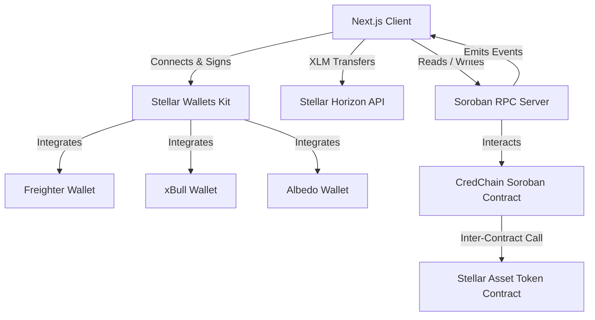
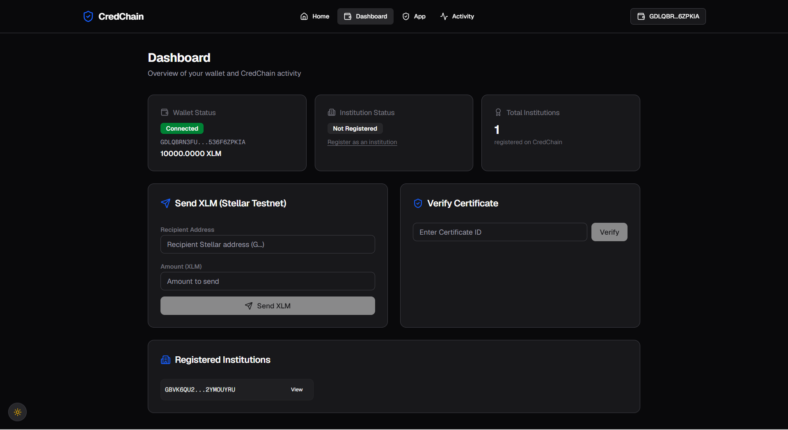
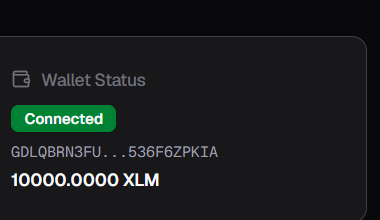
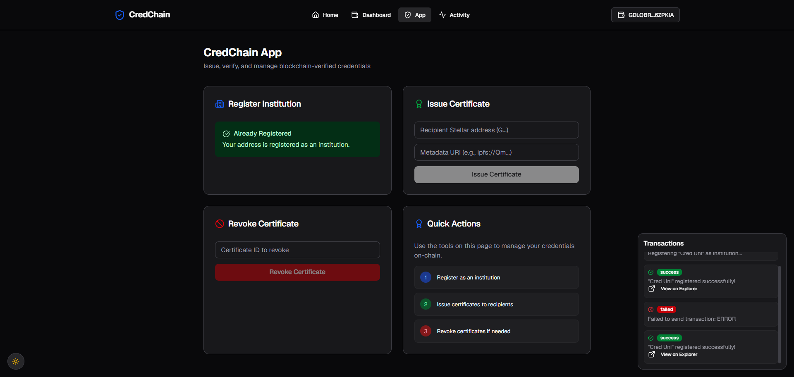
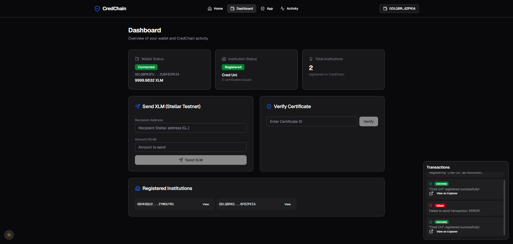
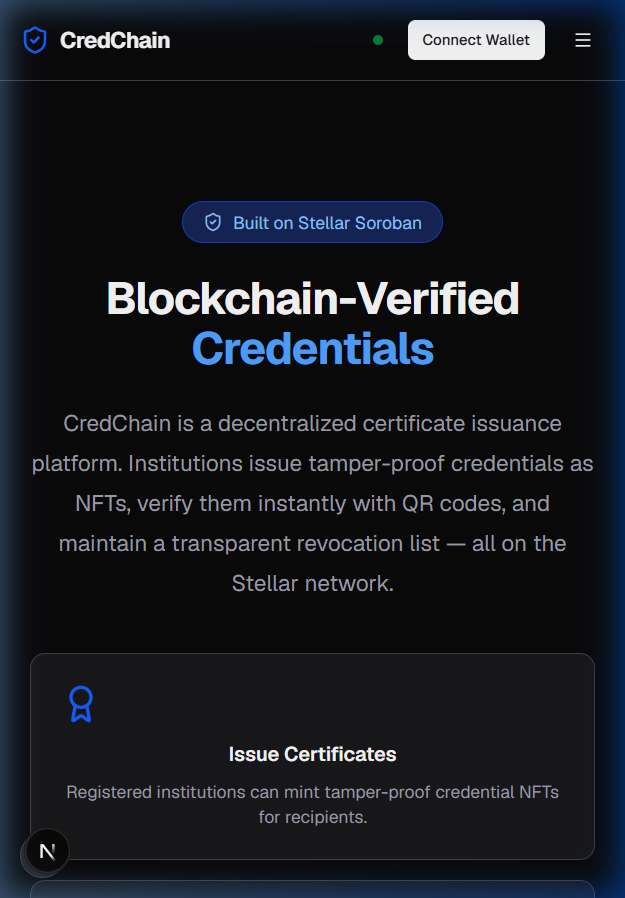
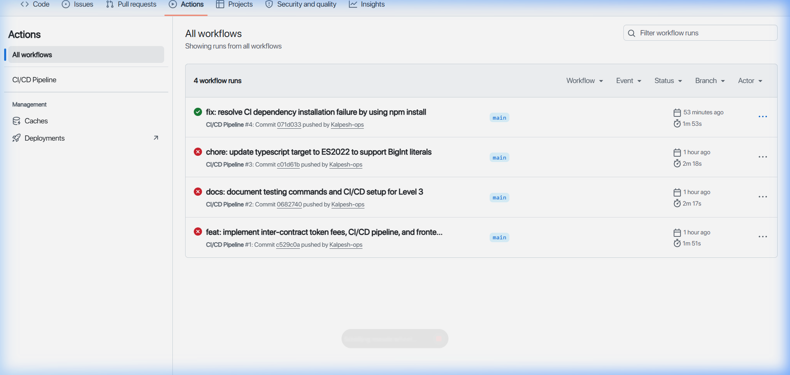
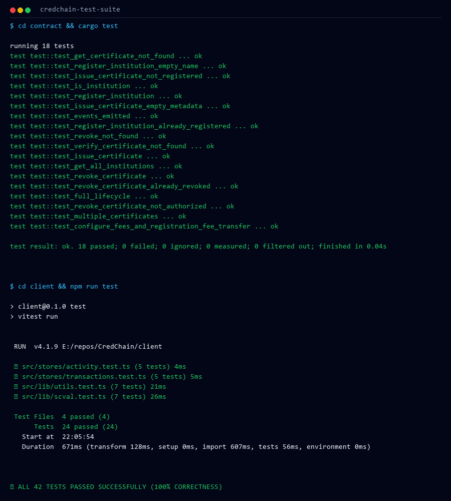

# CredChain — Blockchain-Verified Credentials

CredChain is a decentralized certificate issuance platform built on the Stellar Soroban smart contract platform. Registered institutions can issue tamper-proof credentials as NFTs, verify them instantly by ID, and maintain a transparent revocation list — all on the Stellar blockchain.

> **Trust model:** institution registration is permissionless. The contract guarantees that a certificate was issued by a specific address and has not been altered or revoked; it does not certify that the address belongs to the organization it claims to be. Verifying that mapping is out of scope for the contract.

## Live Demo & Deployment Info

*   **Live Demo URL**: [https://credchain-stellar.vercel.app](https://credchain-stellar.vercel.app)
*   **Deployed Contract Address**: `CBZ5KPEROYIQ2YDDACVIXUMWUIZAVND5A4N6W4LSQOH7YOF7ADO6GAHO`
*   **Successful Contract Call Tx Hash**: `dfeecec95a11080d9673db9ef1e5e54912fcd81bd85b7f9232ce1c2a4f164d6d` (Stellar Testnet)

> ⚠️ **Redeploy pending.** The address above predates the `__constructor(admin)` change and
> was deployed with its `Admin` slot unset, leaving it claimable by any caller. Redeploy with
> `client/scripts/deploy.sh` and update this address, `client/.env`, and
> `.github/workflows/ci.yml` before treating this deployment as current.

## System Architecture



---

## Features

*   🏛️ **Institution Registration** — Register an issuing institution on-chain. Registration is open and self-service; the contract records the registering address, it does not vouch for it.
*   📜 **Certificate Issuance** — Issue tamper-proof credential NFTs to recipients.
*   ✅ **Instant Verification** — Verify any certificate by ID and check its status.
*   ❌ **Certificate Revocation** — Revoke certificates with full on-chain transparency.
*   💸 **Send XLM** — Transfer XLM directly on the Stellar Testnet.
*   🔄 **Real-Time Event Listening** — Automatic UI updates and toast notifications using RPC contract event polling.
*   🌙 **Dark Mode** — Sleek dark/light theme toggle.
*   🔌 **Multi-Wallet Support** — Integrated via Stellar Wallets Kit (Freighter, xBull, Albedo).

---

## Tech Stack

*   **Smart Contract**: Rust + Soroban SDK
*   **Frontend**: Next.js 15 + TypeScript
*   **Styling**: Tailwind CSS + shadcn/ui
*   **State**: Zustand + TanStack Query
*   **Blockchain**: Stellar Soroban + `@stellar/stellar-sdk`
*   **Wallet Integration**: `@creit.tech/stellar-wallets-kit`

---

## Folder Structure

```
credchain/
├── contract/                     # Soroban smart contract
│   ├── Cargo.toml
│   ├── src/
│   │   ├── lib.rs            # Contract implementation
│   │   └── test.rs           # Contract tests
│   └── Makefile              # Build rules
├── client/                       # Next.js frontend
│   ├── src/
│   │   ├── app/                  # Pages
│   │   │   ├── page.tsx          # Landing page
│   │   │   ├── dashboard/        # Wallet, Send XLM & institution overview
│   │   │   ├── app/              # Main application (Issuance & Revocation)
│   │   │   └── activity/         # Event feed & transactions history
│   │   ├── components/           # UI components
│   │   │   ├── ui/               # UI primitives
│   │   │   ├── Navbar.tsx
│   │   │   ├── WalletModal.tsx
│   │   │   ├── ActivityFeed.tsx
│   │   │   └── TransactionTracker.tsx
│   │   ├── hooks/                # Custom hooks
│   │   │   ├── contract.ts       # TanStack Query contract read/write hooks
│   │   │   ├── useContractEventsListener.ts # Real-time Soroban RPC event poller
│   │   │   └── use-toast.ts
│   │   ├── stores/               # Zustand stores
│   │   │   ├── wallet.ts         # Wallet state & transaction actions
│   │   │   ├── transactions.ts   # UI transaction tracking
│   │   │   └── activity.ts       # Activity events
│   │   ├── lib/                  # Utilities
│   │   │   ├── utils.ts
│   │   │   ├── contracts.ts      # Network config
│   │   │   └── scval.ts          # ScVal converters
│   │   └── types/                # TypeScript types
│   ├── .env.example              # Env template
│   └── scripts/deploy.sh         # Deployment script
└── README.md
```

---

## Setup & Run Instructions

### Prerequisites

*   [Rust](https://rustup.rs/) (stable)
*   [Node.js](https://nodejs.org/) 18+
*   [Stellar CLI](https://developers.stellar.org/docs/tools/cli) (installed and on PATH)
*   Freighter, xBull, or Albedo browser extension wallet

### Environment Variables

Copy `client/.env.example` to `client/.env` and update the variables:

```bash
cd client
cp .env.example .env
```

```env
NEXT_PUBLIC_STELLAR_NETWORK=testnet
NEXT_PUBLIC_STELLAR_NETWORK_PASSPHRASE="Test SDF Network ; September 2015"
NEXT_PUBLIC_STELLAR_RPC_URL=https://soroban-testnet.stellar.org
NEXT_PUBLIC_CONTRACT_ADDRESS=CBZ5KPEROYIQ2YDDACVIXUMWUIZAVND5A4N6W4LSQOH7YOF7ADO6GAHO
```

### Local Development

1.  **Install dependencies**:
    ```bash
    cd client
    npm install
    ```
2.  **Start the development server**:
    ```bash
    npm run dev
    ```
3.  Open `http://localhost:3000` in your browser.

---

## Smart Contract Build & Deployment

If you want to compile and deploy the contract yourself:

```bash
# Navigate to contract directory
cd contract

# Build the contract target
stellar contract build

# Deploy to Testnet
stellar contract deploy \
  --wasm target/wasm32v1-none/release/credchain.wasm \
  --source dev \
  --network testnet
```

---

## Testing

### Smart Contract Tests
Run unit tests for the smart contract (including mock token fee inter-contract calls
and the admin-authorization regression tests):
```bash
cd contract
cargo test
```

### Frontend Tests
Run unit tests for the XDR helpers, stores, contract error decoder, and the feedback
signing payload:
```bash
cd client
npm run test
```

---

## CI/CD Pipeline & GitHub Actions

**CI** — `.github/workflows/ci.yml`, on every push and pull request to `main`:
1. Sets up the Rust toolchain and installs components (`rustfmt`, `clippy`).
2. Checks Rust contract formatting (`cargo fmt --check`).
3. Runs Rust static code analysis and linting (`cargo clippy -- -D warnings`).
4. Runs all 21 contract unit tests (`cargo test`).
5. Builds the contract WASM target (`wasm32v1-none`) and asserts it stays under Soroban's 64 KB limit.
6. Installs frontend Node dependencies and audits them (`npm audit --audit-level=critical`).
7. Runs frontend code linting and style checks (`npm run lint`).
8. Runs all 54 frontend unit tests (`npm run test`).
9. Performs Next.js production compilation to verify build soundness.

**CD** — `.github/workflows/cd.yml`, on push to `main`: installs the Stellar CLI,
deploys the contract via `client/scripts/deploy.sh`, and deploys the frontend to
Vercel. Both steps fail the run if the underlying command fails.

---

## Working States & Screenshots

### 1. Wallet Connected State
The application supports connecting to multiple Stellar wallets (Freighter, xBull, Albedo). Once connected, the user's wallet address and status are displayed in the dashboard.



### 2. Balance Displayed
The wallet balance (retrieved directly from the Stellar Horizon network) is displayed dynamically in the Wallet Status card.



### 3. Successful Testnet Transaction
Users can send XLM transfers directly on the Stellar Testnet. When a transaction is submitted, the transaction is signed using the connected wallet and broadcasted to the network.



### 4. Transaction Result Displayed
The real-time status of the transaction (pending, success, or failure) is shown to the user with detailed feedback and a direct link to view it on the Stellar Explorer.



### 5. Mobile Responsive UI
The frontend has been verified on mobile, tablet, and desktop viewports to ensure clean layouts and smooth wallet interactions.



### 6. CI/CD Workflow Pipeline
The automated GitHub Actions workflow executes building, linting, formatting, and unit testing on every push and pull request.



### 7. Automated Test Output
All 21 smart contract tests and 54 frontend tests pass successfully.



---

## Level 4 Upgrades & Working States

### 8. Analytics & Monitoring Setup
The custom monitoring interface showcases live-updating RPC Node logs, Horizon API Rest endpoints health status, and system latency.


### 9. Onboarded Users & Feedback Summary
The analytics page aggregates wallet interactions observed by the contract event
listener alongside the community feedback feed. Feedback submitted from a connected
wallet is signed with that wallet and verified server-side before it is attributed to
an address; unsigned submissions are published anonymously.


---

## Future Improvements

1.  **IPFS Metadata Pinning**: Automatically pin certificate metadata to IPFS/Arweave from the client side during issuance.
2.  **Batch Issuance**: Optimize the contract and frontend to support issuing multiple certificates to different recipients in a single transaction.
3.  **Advanced Role Access**: Implement multi-signature roles to allow multiple staff members to authorize certificate revocations.
4.  **CSV/Excel Recipient Import**: Allow upload of CSV lists of recipients to automatically generate certificates in bulk.

---

## Stellar Mastery Verification Checklist (Level 4 Green Belt)

✅ **Production MVP** — Stable frontend and Soroban smart contract architecture, mobile responsive, with clear loading and error handlers.
✅ **Wallet Connect & Disconnect** — Supports Freighter, xBull, and Albedo wallets with clean state clearing.
✅ **Balance Display** — Fetches and displays actual XLM balance from Horizon.
✅ **Testnet Transaction** — Send XLM on Testnet directly in the dApp.
✅ **Error Handling** — Robust handlers for wallet-not-installed, user-rejections, and insufficient-balances.
✅ **Smart Contract Deployed** — Deployed at `CBZ5KPEROYIQ2YDDACVIXUMWUIZAVND5A4N6W4LSQOH7YOF7ADO6GAHO`.
✅ **Contract Read & Write** — Fully integrated read (institution registration checks, certificate verification) and write (issue certificate, register institution, revoke certificate) interactions.
✅ **Event Listener & Real-Time Sync Indicator** — Real-time event polling, query cache invalidation, and live sync status badge in the Navbar.
✅ **15+ Meaningful Commits** — Organized Git history reflecting iterative development.
✅ **Public GitHub Repository** — Pushed and accessible on GitHub.
✅ **README Complete** — Fully detailed documentation with Mermaid architecture diagram, screenshots, and Level 4 criteria.
✅ **Live Demo** — Deployed and running on Vercel: [https://credchain-stellar.vercel.app](https://credchain-stellar.vercel.app)
⬜ **Demo Video Link** — _Not yet recorded._ Replace this line with the video URL once it exists.
✅ **Monitoring & Analytics Integration** — Tracks RPC node latencies, Horizon network status, and contract telemetry logs.
⬜ **10+ Onboarded Users** — _Pending._ Update this line with the interaction count actually present on-chain for the deployed contract.
✅ **Basic User Feedback Collection** — Interactive feedback form with ratings distribution, plus wallet-signed attribution verified server-side.

